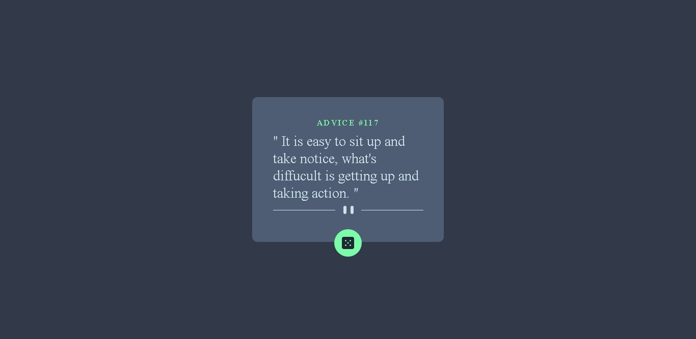
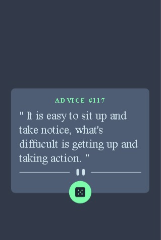

# Frontend Mentor - Advice generator app solution

This is a solution to the [Advice generator app challenge on Frontend Mentor](https://www.frontendmentor.io/challenges/advice-generator-app-QdUG-13db). Frontend Mentor challenges help you improve your coding skills by building realistic projects.

## Table of contents

- [Overview](#overview)
  - [The challenge](#the-challenge)
  - [Screenshot](#screenshot)
  - [Links](#links)
- [My process](#my-process)
  - [Built with](#built-with)
  - [What I learned](#what-i-learned)
  - [Continued development](#continued-development)
  - [Useful resources](#useful-resources)
- [Author](#author)
- [Acknowledgments](#acknowledgments)

**Note: Delete this note and update the table of contents based on what sections you keep.**

## Overview
This is an advice generotor that gives you a random advice whenever the dice icon is clicked

### The challenge
T build out this advice generator app using the [Advice Slip API](https://api.adviceslip.com) and get it looking as close to the design as possible.

Users should be able to:

- View the optimal layout for the app depending on their device's screen size
- See hover states for all interactive elements on the page
- Generate a new piece of advice by clicking the dice icon

### Screenshot

### Links

- Solution URL: [Add solution URL here](https://your-solution-url.com)
- Live Site URL: [Add live site URL here](https://your-live-site-url.com)

## My process

### Built with

- Semantic HTML5 markup
- CSS custom properties
- Flexbox
- Mobile-first workflow

### What I learned
Once again i gained more experience while working on this project.  
i got to use the javascript fetch api flex box. handling api error and the rest.

### Continued development
Im currently working on my personal article site. where users will be able to post their articles and can run adds off it.

## Author

- Website - [Winning Godspower](https://winningtech.tk)
- Frontend Mentor - [@winning godspower](https://www.frontendmentor.io/profile/winninggodspower)
- Facebook - [@winning godspower](https://www.facebook.com/winninggodspower)
- Phone - <a href="tel:+2348123902721">08123902721<a>